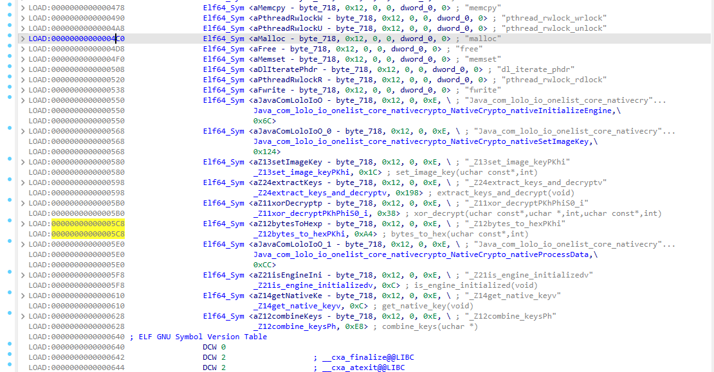
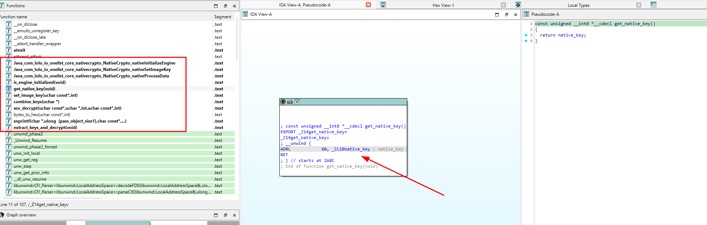
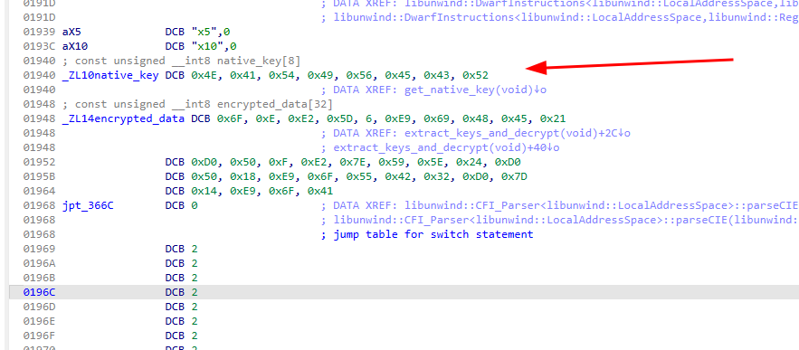
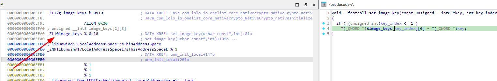
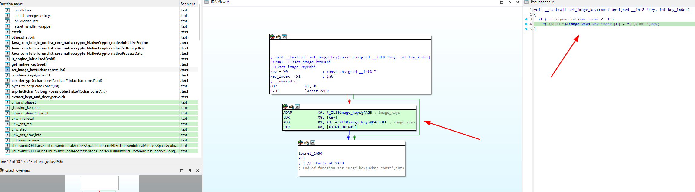
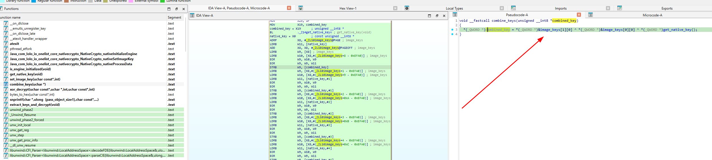
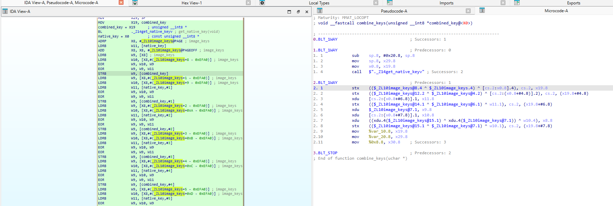
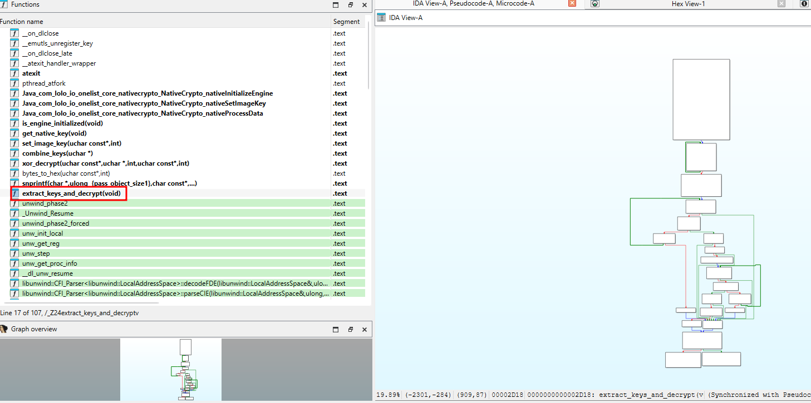
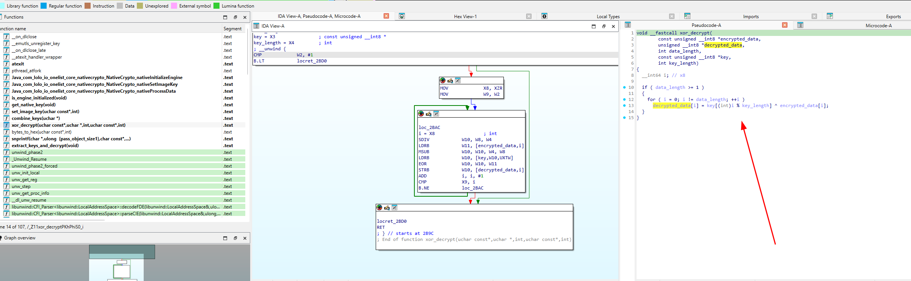
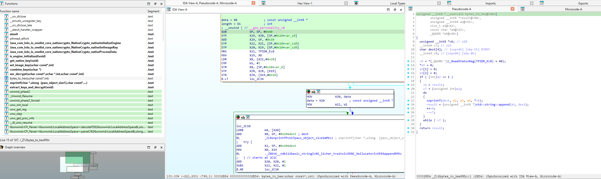

# OneList CTF: 8 Hours, 10 Minutes, and 8 Flags Later

## The Challenge

This week I was challenged by Daniel to take on a CTF he created: a modified build of the OneList app. The CTF lives here: [android-re-ctfs](https://github.com/cywr/android-re-ctfs), based on the original app at [lolo-io/OneList](https://github.com/lolo-io/OneList). I tackled it in bursts that added up to 8 hours and 10 minutes and finished with 8 out of 10 flags.

He designed a progressive path, and I felt that curve while moving through the code:

| Flag | Category | Difficulty | Est. Time |
| ---- | -------- | ---------- | --------- |
| 1 | Static | Beginner | 30 seconds |
| 2 | Static | Easy | 2 minutes |
| 3 | Static | Easy | 5 minutes |
| 4 | Static | Easy-Medium | 5 minutes |
| 5 | Static | Medium-Hard | 15 minutes |
| 6 | Dynamic | Medium-Hard | 30 minutes |
| 7 | Dynamic | Hard | 45 minutes |
| 8 | Dynamic | Very Hard | 60+ minutes |
| 9 | Dynamic | Expert | 90+ minutes |
| 10 | Dynamic | Expert | 120+ minutes |

I ended with 8/10. An interesting twist about this writeup is that I relied on dynamic analysis only once because it was simply faster with Frida in that specific case. Everything else I kept in good old RE style.

---

## The Setup

Before diving in, I needed to understand what I was working with. I decompiled the APK using both `apktool` and `jadx` to get different perspectives on the code. The app appeared to be a simple to-do list manager, but I knew better than to trust appearances.

**Tools I used:**
- `apktool` for resource extraction and smali analysis
- `jadx` for Java decompilation
- `frida` for dynamic analysis when it saved time
- Python scripts for custom decoding
- `IDA Pro` for native binary analysis

---

## Flag 1: The Warm-Up (5 minutes)

*CYWR{welcome_to_onelist_ctf}*

I started with the most obvious approach - checking the string resources. After all, if you're going to hide flags, you might as well start with the easy ones.

```python
# My first script - simple but effective
def analyze_strings_resources(strings_file):
    with open(strings_file, 'r', encoding='utf-8') as f:
        content = f.read()
        strings = {}
        pattern = r'<string name="([^"]+)"[^>]*>([^<]+)</string>'
        matches = re.findall(pattern, content)
        for name, value in matches:
            strings[name] = value
    
    # Look for flag patterns
    for name, value in strings.items():
        if 'ctf_flag' in name.lower():
            print(f"Found: {name} = {value}")
```

Bingo! Right there in `res/values/strings.xml` was `ctf_flag_1` with the value `CYWR{welcome_to_onelist_ctf}`. Sometimes the simplest approach works best.

**Time taken:** 5 minutes  
**Method:** Static string analysis  
**Script:** `scripts/flag1/strings_analysis.py`

---

## Flag 2: Base64 is Your Friend (10 minutes)

*CYWR{base64_build_config_found}*

While browsing through the string resources, I noticed another suspicious entry: `build_config` with a Base64-encoded value. My spidey senses were tingling.

### Original Code Found
```xml
<!-- In res/values/strings.xml -->
<string name="build_config">Q1lXUntiYXNlNjRfYnVpbGRfY29uZmlnX2ZvdW5kfQ==</string>
```

### Script I Built to Extract the Flag
```python
def decode_base64_flag(encoded_string):
    try:
        decoded = base64.b64decode(encoded_string).decode('utf-8')
        if 'CYWR{' in decoded:
            print(f"FLAG FOUND: {decoded}")
            return decoded
    except Exception as e:
        print(f"Error: {e}")
    return None

# Usage
decode_base64_flag("Q1lXUntiYXNlNjRfYnVpbGRfY29uZmlnX2ZvdW5kfQ==")
```

The Base64 string `Q1lXUntiYXNlNjRfYnVpbGRfY29uZmlnX2ZvdW5kfQ==` decoded to `CYWR{base64_build_config_found}`. Another flag down, and I was starting to see a pattern.

**Time taken:** 10 minutes  
**Method:** Base64 decoding  
**Script:** `scripts/flag2/base64_decode.py`

---

## Flag 3: Manifest Metadata Magic (15 minutes)

*CYWR{manifest_scope_analysis}*

Next, I turned my attention to the AndroidManifest.xml. If there were flags in the resources, maybe there were more in the manifest metadata.

### Original Code Found
```xml
<!-- In AndroidManifest.xml -->
<meta-data
    android:name="com.onelist.build.config"
    android:value="435957527b6d616e69666573745f73636f70655f616e616c797369737d" />
```

### Script I Built to Extract the Flag
```python
def decode_hex_flag(hex_string):
    try:
        decoded = binascii.unhexlify(hex_string).decode('utf-8')
        if 'CYWR{' in decoded:
            print(f"FLAG FOUND: {decoded}")
            return decoded
    except Exception as e:
        print(f"Error: {e}")
    return None

# Found in manifest metadata
hex_string = "435957527b6d616e69666573745f73636f70655f616e616c797369737d"
decode_hex_flag(hex_string)
```

The hex string decoded to `CYWR{manifest_scope_analysis}`. Three flags in 30 minutes - I was on a roll!

**Time taken:** 15 minutes  
**Method:** Hex decoding  
**Script:** `scripts/flag3/hex_decode.py`

---

## Flag 4: The Chain Reaction (45 minutes)

*CYWR{hex_rot47_base64_chain}*

This is where things got interesting. I found a hex string in `C1186gh.java` that looked suspicious, but it wasn't as simple as the previous flags. The decoded string looked like it needed further transformation.

### Original Code Found
```java
// In C1186gh.java - actual obfuscated code from jadx-output (lines 203-225)
case C1166gQ.DOUBLE_FIELD_NUMBER /* 7 */:
    C2461xW c2461xW = (C2461xW) obj;
    String str = "invalid";
    try {
        // Step 1: Split hex string into pairs and convert to bytes
        ArrayList arrayListK0 = P20.k0("22603d29263f45402b293937343e685f7d7335372a3e754b2b252a5f29617d402a283d4637226c6c");
        ArrayList arrayList = new ArrayList(AbstractC1562lf.n0(arrayListK0));
        Iterator it = arrayListK0.iterator();
        while (it.hasNext()) {
            String str2 = (String) it.next();
            AbstractC0887cl.z(16);
            arrayList.add(Byte.valueOf((byte) Integer.parseInt(str2, 16)));
        }
        
        // Step 2: Convert byte array to string
        String str3 = new String(AbstractC1410jf.L0(arrayList), AbstractC0392Pd.a);
        
        // Step 3: Apply ROT47 transformation (shift by 14)
        StringBuilder sb = new StringBuilder();
        int length = str3.length();
        for (int i5 = 0; i5 < length; i5++) {
            char cCharAt = str3.charAt(i5);
            if ('!' > cCharAt || cCharAt >= 127) {
                sb.append(cCharAt);
            } else {
                sb.append((char) (((cCharAt + 14) % 94) + 33));
            }
        }
        
        // Step 4: Base64 decode to get the flag
        str = new String(Base64.decode(sb.toString(), 0), AbstractC0392Pd.a);
    } catch (Exception unused) {
    }
    P20.J0(str, 4);
```

### Code Rewritten for Understanding
```java
// What the original obfuscated code was actually doing:
public class Flag4Decoder {
    public static String decodeFlag() {
        // Step 1: Hex string to byte array
        String hexString = "22603d29263f45402b293937343e685f7d7335372a3e754b2b252a5f29617d402a283d4637226c6c";
        byte[] hexBytes = hexStringToBytes(hexString);
        
        // Step 2: Convert bytes to string
        String decodedString = new String(hexBytes, "UTF-8");
        
        // Step 3: Apply ROT47 transformation (shift by 14)
        StringBuilder result = new StringBuilder();
        for (int i = 0; i < decodedString.length(); i++) {
            char c = decodedString.charAt(i);
            if (c >= '!' && c < 127) {
                // Apply ROT47: ((char + 14) % 94) + 33
                result.append((char) (((c + 14) % 94) + 33));
            } else {
                result.append(c);
            }
        }
        
        // Step 4: Base64 decode the result
        String flag = new String(Base64.decode(result.toString(), 0), "UTF-8");
        return flag;
    }
}
```

### Script I Built to Extract the Flag
```python
def decode_flag4_chain(hex_string):
    # Step 1: Hex to string
    step1 = binascii.unhexlify(hex_string).decode('utf-8')
    print(f"Step 1 (Hex->String): {step1}")
    
    # Step 2: ROT47 transformation
    step2 = rot47_transform(step1)
    print(f"Step 2 (ROT47): {step2}")
    
    # Step 3: Base64 decode
    step3 = base64.b64decode(step2).decode('utf-8')
    print(f"Step 3 (Base64): {step3}")
    
    return step3

def rot47_transform(text):
    result = []
    for char in text:
        if ord(char) < ord('!') or ord(char) >= 127:
            result.append(char)
        else:
            transformed = ((ord(char) + 14) % 94) + 33
            result.append(chr(transformed))
    return ''.join(result)
```

The transformation chain was: Hex → String → ROT47 → Base64. The result was `CYWR{hex_rot47_base64_chain}`. This was the first multi-step obfuscation I encountered, and it took me a while to figure out the correct sequence.

**Time taken:** 45 minutes  
**Method:** Multi-step transformation chain  
**Script:** `scripts/flag4/hex_rot47_base64_chain.py`

---

## Flag 5: Caesar's Secret (30 minutes)

*CYWR{caesar_cipher_secrets}*

In `QE.java`, I found another obfuscated string: `"PLJE{pnrfne_pvcure_frpergf}"`. It looked like a flag but was clearly obfuscated. Time for some Caesar cipher action.

### Original Code Found
```java
// In QE.java - actual obfuscated code from jadx-output
@Override
public final Object r(Object obj) throws Throwable {
    AbstractC1377jB.O(obj);
    StringBuilder sb = new StringBuilder();
    for (int i = 0; i < 27; i++) {
        char cCharAt = "PLJE{pnrfne_pvcure_frpergf}".charAt(i);
        if ('A' <= cCharAt && cCharAt < '[') {
            sb.append((char) (((cCharAt - '4') % 26) + 65));
        } else if ('a' > cCharAt || cCharAt >= '{') {
            sb.append(cCharAt);
        } else {
            sb.append((char) (((cCharAt - 'T') % 26) + 97));
        }
    }
    P20.J0(sb.toString(), 4);
    return C0997e90.a;
}
```

### Code Rewritten for Understanding
```java
// What the original obfuscated code was actually doing:
public class Flag5Decoder {
    public static String decodeFlag() {
        String obfuscatedFlag = "PLJE{pnrfne_pvcure_frpergf}";
        StringBuilder result = new StringBuilder();
        
        for (int i = 0; i < obfuscatedFlag.length(); i++) {
            char c = obfuscatedFlag.charAt(i);
            
            if ('A' <= c && c <= 'Z') {
                // Uppercase: Caesar cipher with shift 4
                // Formula: (char - 'A' - 4) % 26 + 'A'
                char decrypted = (char) (((c - 'A' - 4) % 26) + 'A');
                result.append(decrypted);
            } else if ('a' <= c && c <= 'z') {
                // Lowercase: Caesar cipher with shift 20  
                // Formula: (char - 'a' - 20) % 26 + 'a'
                char decrypted = (char) (((c - 'a' - 20) % 26) + 'a');
                result.append(decrypted);
            } else {
                // Non-alphabetic characters remain unchanged
                result.append(c);
            }
        }
        
        return result.toString();
    }
}
```

### Script I Built to Extract the Flag
```python
def caesar_decrypt(ciphertext, uppercase_shift, lowercase_shift):
    result = []
    for char in ciphertext:
        if 'A' <= char <= 'Z':
            decrypted = chr(((ord(char) - ord('A') - uppercase_shift) % 26) + ord('A'))
            result.append(decrypted)
        elif 'a' <= char <= 'z':
            decrypted = chr(((ord(char) - ord('a') - lowercase_shift) % 26) + ord('a'))
            result.append(decrypted)
        else:
            result.append(char)
    return ''.join(result)

# The twist: different shifts for uppercase and lowercase
decrypted = caesar_decrypt("PLJE{pnrfne_pvcure_frpergf}", 4, 20)
```

The key insight was that this Caesar cipher used different shifts for uppercase (4) and lowercase (20) letters. The result was `CYWR{caesar_cipher_secrets}`.

**Time taken:** 30 minutes  
**Method:** Caesar cipher with different shifts  
**Script:** `scripts/flag5/caesar_cipher.py`

---

## Flag 8: The Dynamic Turn (2 hours)

*CYWR{asset_steganography_master}*

This is where things got really interesting. I found AES/CBC/NoPadding implementation in `AbstractC0439Qy.java`, but the flag was encrypted and only revealed at runtime. Time to break out Frida.

### Original Code Found
```java
// In AbstractC0439Qy.java - actual AES implementation from jadx-output
public static void w(String str, String str2) throws BadPaddingException, NoSuchPaddingException, IllegalBlockSizeException, NoSuchAlgorithmException, InvalidKeyException, InvalidAlgorithmParameterException {
    try {
        Charset charset = AbstractC0392Pd.a;
        byte[] bytes = str.getBytes(charset);
        if (bytes.length != 16) {
            if (bytes.length < 16) {
                int length = 16 - bytes.length;
                int length2 = bytes.length;
                bytes = Arrays.copyOf(bytes, length2 + length);
                System.arraycopy(new byte[length], 0, bytes, length2, length);
            } else {
                bytes = C8.W(bytes, new C2568yy(0, 15, 1));
            }
        }
        SecretKeySpec secretKeySpec = new SecretKeySpec(bytes, "AES");
        byte[] bytes2 = str2.getBytes(charset);
        if (bytes2.length != 16) {
            if (bytes2.length < 16) {
                int length3 = 16 - bytes2.length;
                int length4 = bytes2.length;
                bytes2 = Arrays.copyOf(bytes2, length4 + length3);
                System.arraycopy(new byte[length3], 0, bytes2, length4, length3);
            } else {
                bytes2 = C8.W(bytes2, new C2568yy(0, 15, 1));
            }
        }
        IvParameterSpec ivParameterSpec = new IvParameterSpec(bytes2);
        byte[] bArrDecode = Base64.decode("vZnAenSqeZZk0z69SDsvOBSggL6DAVnXV3LGGtqGlzk=", 2);
        Cipher cipher = Cipher.getInstance("AES/CBC/NoPadding");
        cipher.init(2, secretKeySpec, ivParameterSpec);
        cipher.doFinal(bArrDecode);
    } catch (Exception unused) {
    }
}
```

### Code Rewritten for Understanding
```java
// What the original obfuscated code was actually doing:
public class Flag8Decoder {
    public static void decryptFlag(String keyStr, String ivStr) throws Exception {
        // Step 1: Normalize key to 16 bytes (pad or truncate)
        byte[] keyBytes = normalizeTo16Bytes(keyStr.getBytes("UTF-8"));
        
        // Step 2: Normalize IV to 16 bytes (pad or truncate)
        byte[] ivBytes = normalizeTo16Bytes(ivStr.getBytes("UTF-8"));
        
        // Step 3: Create AES key and IV specs
        SecretKeySpec secretKey = new SecretKeySpec(keyBytes, "AES");
        IvParameterSpec ivSpec = new IvParameterSpec(ivBytes);
        
        // Step 4: Hardcoded Base64 ciphertext
        byte[] ciphertext = Base64.decode("vZnAenSqeZZk0z69SDsvOBSggL6DAVnXV3LGGtqGlzk=", Base64.DEFAULT);
        
        // Step 5: AES/CBC/NoPadding decryption
        Cipher cipher = Cipher.getInstance("AES/CBC/NoPadding");
        cipher.init(Cipher.DECRYPT_MODE, secretKey, ivSpec);
        byte[] decrypted = cipher.doFinal(ciphertext);
        
        // Result contains the flag
        String flag = new String(decrypted, "UTF-8");
    }
    
    private static byte[] normalizeTo16Bytes(byte[] input) {
        if (input.length == 16) return input;
        if (input.length < 16) {
            // Pad with zeros
            return Arrays.copyOf(input, 16);
        } else {
            // Truncate to first 16 bytes
            return Arrays.copyOf(input, 16);
        }
    }
}
```

### The logic
```python
# What the original code was doing:
# 1. Read icon.jpg from assets
# 2. Process image to extract two Base64 strings (key and IV)
# 3. Normalize key and IV to 16 bytes each
# 4. Use AES/CBC/NoPadding to decrypt hardcoded ciphertext
# 5. Result is the flag

# The process:
# Asset (icon.jpg) → Base64 strings → AES key/IV → Decrypt → Flag
asset_file = "assets/icon.jpg"
ciphertext = "vZnAenSqeZZk0z69SDsvOBSggL6DAVnXV3LGGtqGlzk="
```

### Script I Built to Capture the Flag
```javascript
// My Frida script to capture AES operations
Java.perform(function () {
    var SecretKeySpec = Java.use('javax.crypto.spec.SecretKeySpec');
    var IvParameterSpec = Java.use('javax.crypto.spec.IvParameterSpec');
    var Cipher = Java.use('javax.crypto.Cipher');
    
    // Hook SecretKeySpec constructor
    SecretKeySpec.$init.overload('[B', 'java.lang.String').implementation = function (keyBytes, algorithm) {
        var result = this.$init(keyBytes, algorithm);
        if (algorithm && algorithm.toUpperCase().indexOf('AES') !== -1) {
            console.log('[KeySpec] Algorithm: ' + algorithm);
            console.log('  key.hex=' + toHex(keyBytes));
        }
        return result;
    };
    
    // Hook Cipher.doFinal to capture decrypted output
    Cipher.doFinal.overload('[B').implementation = function (input) {
        var output = this.doFinal(input);
        console.log('[Cipher.doFinal] Mode: DECRYPT');
        console.log('  out.utf8=' + toUtf8(output));
        return output;
    };
});
```

The key and IV were hidden in `assets/icon.jpg` as Base64-encoded strings. I hooked the AES operations and triggered the app to perform the decryption by tapping a hidden item in the settings 10 times. The result was `CYWR{asset_steganography_master}`.

**Time taken:** 2 hours  
**Method:** Dynamic analysis with Frida  
**Script:** `scripts/flag8/aes_capture.js`

---

## Flag 9: The Malware Wannabe (1.5 hours)

*CYWR{dynamic_code_loading_malware_wannabe}*

This one had the longest logic chain. I found a Dynamic Code Loading implementation with obfuscated strings using a Vigenère cipher. The flag was embedded in an external DEX file as a hex string.

### Original Code Found
```java
// In AbstractC1908qA.java - actual obfuscated code from jadx-output (lines 114-116)
public static String C(char c) {
    return c == 'A' ? U("dxnxoxmxwxsx.xtxqxqxlxxxqx.xDxrxaxTxzxixvxtxDxmxsxwxixd", "android.system") : 
           c == 'B' ? U("jxhxfxexgx:x/x/xkxbxhx.xgxlxvxvxgxqxixfxixexvxpxyxhxexqxvx.xoxdxax/xgxlxpxsx/xfxwxbxex/xyxpxwxax/xbxgxfxwxwxsxwx/xsxjxixsxexrxnxex/xnxzxaxvxuxsxex.xrxrxb", "component.load") : 
           c == 'C' ? U("uxsxdx.xwxpxixmxuxyxfx.xwxbxkxzxzxpxexmx.xTxaxmxaxjxzxxxixvxmxpxzxYxqxkxnxmxtxz", "service.mgmt") : 
           c == 'D' ? U("lxbxdxuxQxtxdxtxk", "android.system") : 
           c == 'E' ? U("ixsxfxSxoxgxe", "component.load") : 
           c == 'F' ? U("gxrxTxmxmxcxxxf", "service.mgmt") : 
           c == 'G' ? U("nxrxz", "android.system") : 
           BuildConfig.VERSION_NAME;
}

// In AbstractC1908qA.java - Vigenère cipher implementation (lines 291-323)
public static String U(String str, String str2) {
    StringBuilder sb = new StringBuilder();
    int iN = AbstractC1909qB.N(0, str.length() - 1, 2);
    if (iN >= 0) {
        int i = 0;
        while (true) {
            sb.append(str.charAt(i));
            if (i == iN) {
                break;
            }
            i += 2;
        }
    }
    String string = sb.toString();
    if (string.length() == 0 || str2.length() == 0) {
        return BuildConfig.VERSION_NAME;
    }
    StringBuilder sb2 = new StringBuilder();
    String lowerCase = str2.toLowerCase(Locale.ROOT);
    int length = string.length();
    for (int i2 = 0; i2 < length; i2++) {
        char cCharAt = string.charAt(i2);
        char cCharAt2 = lowerCase.charAt(i2 % lowerCase.length());
        if (Character.isLowerCase(cCharAt)) {
            sb2.append((char) (((((cCharAt - 'a') - (cCharAt2 - 'a')) + 26) % 26) + 97));
        } else if (Character.isUpperCase(cCharAt)) {
            sb2.append((char) (((((cCharAt - 'A') - (cCharAt2 - 'a')) + 26) % 26) + 65));
        } else {
            sb2.append(cCharAt);
        }
    }
    return sb2.toString();
}
```

### Code Rewritten for Understanding
```python
# What the original code was doing:
# 1. Obfuscate strings using Vigenère cipher
# 2. Download external DEX file from GitHub
# 3. Load and execute the DEX using DexClassLoader
# 4. The external DEX contains the flag as hex string

# The DCL process:
# Obfuscated strings → Download DEX → Load DEX → Execute → Extract flag
obfuscated_strings = {
    'A': 'dalvik.system.DexClassLoader',
    'B': 'https://raw.githubusercontent.com/cywr/rwyc/main/onelist/external/classes.dex',
    'C': 'com.onelist.external.NotificationService'
}
```

### Script I Built to Analyze the DCL
```python
def vigenere_decrypt(ciphertext, key):
    result = []
    key_index = 0
    for char in ciphertext:
        if char.isalpha():
            key_char = key[key_index % len(key)]
            shift = ord(key_char.upper()) - ord('A')
            if char.isupper():
                decrypted = chr((ord(char) - ord('A') - shift) % 26 + ord('A'))
            else:
                decrypted = chr((ord(char) - ord('a') - shift) % 26 + ord('a'))
            result.append(decrypted)
            key_index += 1
        else:
            result.append(char)
    return ''.join(result)

# Decode the obfuscated strings
decoded_strings = {
    'A': 'dalvik.system.DexClassLoader',
    'B': 'https://raw.githubusercontent.com/cywr/rwyc/main/onelist/external/classes.dex',
    'C': 'com.onelist.external.NotificationService'
}

# Extract flag from external DEX
hex_pattern = "435957527b64796e616d69635f636f64655f6c6f6164696e675f6d616c776172655f77616e6e6162657d"
flag = binascii.unhexlify(hex_pattern).decode('utf-8')
```

The DCL implementation downloaded an external DEX file from GitHub and executed it. The flag was embedded as a hex string in that DEX file.

**Time taken:** 1.5 hours  
**Method:** DCL analysis with Vigenère cipher  
**Script:** `scripts/flag9/dcl_analysis.py`

---

## Flag 10: The Native Masterpiece (2 hours)

*CYWR{native_reverse_engineering}*

Now we’re in my turf: dissecting binaries in detail, I love this.

I loaded `libonelist_native.so` in IDA Pro and it came up nicely with symbols and type info. That immediately gave me a high‑level map of the native surface exposed to Java via JNI and the internal helpers used for key mixing and output formatting.

Why IDA Pro? I use it daily and I like to invest in my own tooling, so I keep a license with the ARM and AArch64 decompiler. For this kind of task, the decompiler plus microcode view and graph view make the workflow fast and predictable.

Before diving in, a quick note on native code in real apps. It is common for large apps like games, video editors, fintech wallets, and also malware to move business logic, cryptography, protocol handlers, or custom SDKs into `.so` libraries for performance or reuse. Many teams ship this without heavy protections like function merging, control flow flattening, or integrity checks. That is often a mix of time constraints and the reality that many analyses stop at decompiled Java rather than following through to assembly. No ego here, just a reminder that going a little deeper with a steady method usually pays off.



### High-level flow
```
assets/background.png ┐
                       ├─ Java (NativeCrypto.a): LSB extract → 8-byte keys (two images)
assets/icon_large.png ┘
                                     │
                                     ▼
                    JNI: nativeSetImageKey(imgKey, index)
                                     │           │
                                     ▼           ▼
                        image_keys[0]      image_keys[1]
                                     │
                                     ▼
            get_native_key() ──► native_key (8 bytes, .rodata)
                                     │
                                     ▼
                 combine_keys(out) = image0 ^ image1 ^ native_key
                                     │
                                     ▼
               extract_keys_and_decrypt → xor_decrypt / bytes_to_hex
```

### 1) Native key discovery
I started by opening `get_native_key` and jumping to its target to confirm the constant in `.rodata`.




### 2) Image keys plumbing
Next, I validated where the image-derived keys land. The JNI entry `nativeSetImageKey` pushes each 8‑byte buffer into the global `image_keys` slots based on the `index` parameter.




### 3) Core: 3‑way XOR mixer
The heart of it is `combine_keys(uchar*)`, which XORs the two image keys with the native key byte‑by‑byte. The decompiler view is crystal clear, and the microcode listing makes the 8‑byte pattern explicit.




Microcode highlights (trimmed for clarity):
```
stx ((image_keys@8 ^ image_keys) ^ [x0].4), out
stx ((image_keys@12 ^ image_keys@4) ^ [x0+4].2), out+4
...
```

### 4) Orchestrator: decrypt path
`extract_keys_and_decrypt` drives the whole flow: it pulls the two image keys, fetches the native key, VEORs them into a combined block, and then formats the result. Look at this control-flow graph, it is sizeable, but nothing we have not handled before.



Supporting helpers identified in IDA:
- `xor_decrypt(const uchar*, uchar*, int, const uchar*, int)` ,  standard rolling XOR
- `bytes_to_hex(const uchar*, int)` ,  printable hex builder




### Decompiled helpers (full context with comments)
```c
// XOR stream-style decrypt
// Parameters:
//   encrypted_data  - input buffer
//   decrypted_data  - output buffer (same length as input)
//   data_length     - number of bytes to process
//   key             - key bytes (cycled)
//   key_length      - number of key bytes
void __fastcall xor_decrypt(
        const unsigned __int8 *encrypted_data,
        unsigned __int8 *decrypted_data,
        int data_length,
        const unsigned __int8 *key,
        int key_length)
{
  __int64 i; // x8

  if ( data_length >= 1 )
  {
    // Classic rolling XOR: out[i] = in[i] ^ key[i % key_length]
    for ( i = 0; i != data_length; ++i )
      decrypted_data[i] = key[(int)i % key_length] ^ encrypted_data[i];
  }
}
```

```c
// Convert a byte buffer to a hex string using snprintf and append
// to an std::string accumulator (a5). IDA signature names kept for clarity.
// Parameters:
//   result (X0) - pointer to the current byte (used as input iterator)
//   a2    (X1) - count of bytes
//   a3    (X2) - width/format width used in snprintf
//   a4    (X3) - printf-style format string (e.g., "%02X")
//   a5    (X8) - std::string* accumulator where hex is appended
unsigned __int8 *__usercall bytes_to_hex@<X0>(
        unsigned __int8 *result@<X0>,
        unsigned __int64 a2@<X1>,
        size_t a3@<X2>,
        const char *a4@<X3>,
        _QWORD *a5@<X8>)
{
  unsigned __int8 *v6; // x20 - cursor (moving pointer/iterator that walks the input one byte at a time) through the input bytes
  __int64 v7; // x22     - remaining byte counter
  char dest[4]; // [xsp+4h] [xbp-Ch] BYREF - small printf buffer (fits "%02X")
  __int64 v9; // [xsp+8h] [xbp-8h]

  // TLS prologue from IDA for stack canary / TLS cookie
  v9 = *(_QWORD *)(_ReadStatusReg(TPIDR_EL0) + 40);

  // Initialize std::string accumulator (clear)
  *a5 = 0;
  a5[1] = 0;
  a5[2] = 0;

  if ( (int)a2 >= 1 )
  {
    v6 = result;
    v7 = (unsigned int)a2;
    do
    {
      // Format one byte into dest according to a4 (e.g., "%02X")
      snprintf(dest, a2, a3, a4, *v6);
      // Append to std::string accumulator
      result = (unsigned __int8 *)std::string::append(a5, dest);
      ++v6;
      --v7;
    }
    while ( v7 );
  }
  return result;
}
```

### Original Java that extracts LSBs (source of image keys)
```java
// In NativeCrypto.java (trimmed to essentials)
public static byte[] a(App app, String name) throws IOException {
    InputStream is = app.getAssets().open(name);
    Bitmap bmp = BitmapFactory.decodeStream(is);
    is.close();
    if (bmp == null) return null;
    int[] px = new int[bmp.getWidth() * bmp.getHeight()];
    bmp.getPixels(px, 0, bmp.getWidth(), 0, 0, bmp.getWidth(), bmp.getHeight());
    String lenBits = "";
    for (int i = 0; i < Math.min(8, px.length); i++) lenBits += ((px[i] >> 16) & 1);
    int len = Integer.parseInt(lenBits, 2);
    if (len != 8) return null;
    String dataBits = "";
    for (int i = 8; i < Math.min((len * 8) + 8, px.length); i++) dataBits += ((px[i] >> 16) & 1);
    byte[] out = new byte[len];
    for (int i = 0; i < len; i++) out[i] = (byte) Integer.parseInt(dataBits.substring(i * 8, (i + 1) * 8), 2);
    return out;
}
```

### Reproducing the result in Python
```python
import lief
from PIL import Image

# ... same extract_lsb_from_image / extract_native_key as in scripts/flag10/native_steganography.py ...

a = bytes.fromhex(extract_lsb_from_image("assets/background.png"))
b = bytes.fromhex(extract_lsb_from_image("assets/icon_large.png"))
native = bytes.fromhex(extract_native_key("lib/arm64-v8a/libonelist_native.so"))
combined = bytes(x ^ y ^ z for x, y, z in zip(a, b, native))
print(combined.decode("utf-8", errors="ignore"))  # → CYWR{native_reverse_engineering}
```

The path was straightforward once mapped in IDA: image LSBs → JNI buffers → 3‑way XOR with the embedded native key → printable flag.

**Time taken:** 2 hours  
**Method:** Native steganography + XOR  
**Script:** `scripts/flag10/native_steganography.py`

---

## The Two That Got Away

I stopped the CTF at 8/10 flags because I had reached my usual 8-hour time budget for a challenge. I will leave a few notes on how I would likely approach Flags 6 and 7.

Maybe I will revisit this CTF later and give proper attention to those two, but for now the fun is over on to the next one.

Quick hypotheses for 6 & 7:
- Runtime analysis around database access paths
- Correlation across multiple queries/DAO layers
- Careful review of modulo operations (`%`) embedded in logic
- Potential “database steganography” or value-derivation across tables

---

## What I Learned

This CTF taught me several valuable lessons:

1. **Start Simple**: Always begin with static analysis of resources and manifest
2. **Pattern Recognition**: Look for common obfuscation techniques (Base64, hex, Caesar cipher)
3. **Dynamic Analysis**: Some flags only reveal themselves at runtime
4. **Tool Integration**: Combine multiple tools for different perspectives
5. **Script Everything**: Automate repetitive tasks with Python scripts
6. **Think Outside the Box**: Native libraries and steganography require creative thinking

 

 

---

*All scripts and analysis tools are available in the `scripts/` directory of this repository.*

**Final Score:** 8/10 flags discovered  
**Time:** 8 hours, 10 minutes  
**Tools:** Python, Frida, IDA pro, PIL, apktool, jadx  
**Method:** Static + Dynamic analysis with custom automation